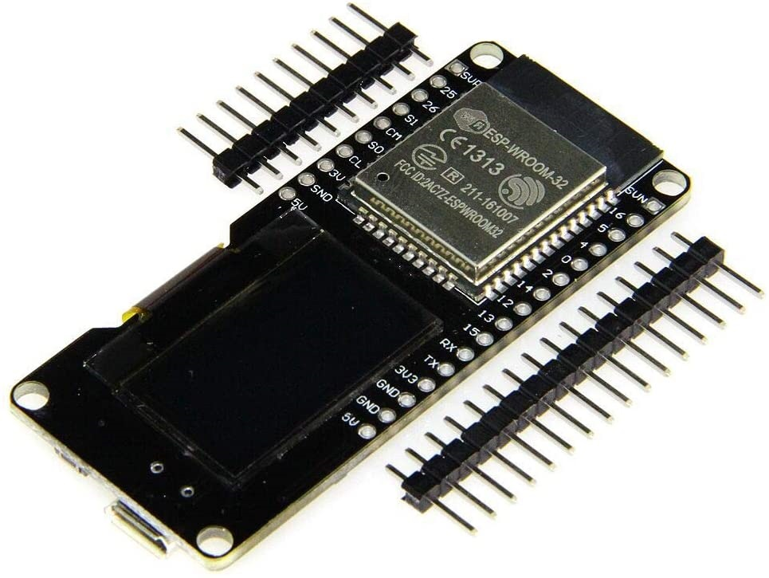
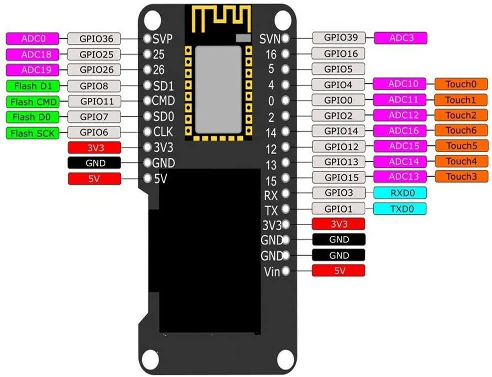
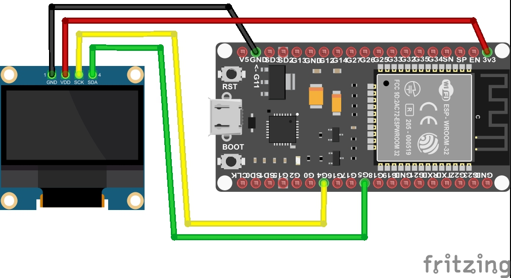

# SSD1306 sample in MicroPython
This project was coded in MicroPython.  
And the code is sample for using SSD1306.   

このプロジェクトは、MicroPython でコーディングしました。  
SSD1306 を使うサンプル実装です。  

## Overview 概要
This project is MicroPython and is created by introducing PyMakr into Visual Studio Code.  
And the platform is ESP32 board, testing of display OLED SSD1306 on the board.  

このプロジェクトは MycroPython で Visual Studio Code に PyMakr を導入して作成しています。  
プラットフォームは ESP32 ボードで、ボードと接続された SSD1306 をテストします。  

* Reference 参考  
    * [[備忘録]ESP32-VSCode-microPythonでの開発環境の構築 - Qiita](https://qiita.com/kotaproj/items/b53006aef9d04053a5ee) (Japanese)  

## Hardware ハードウェア

### ESP32 board with OLED SSD1306
  
  

* Reference 参考  
  * [SSD1306 | Solomon Systech Limited](https://www.solomon-systech.com/en/product/advanced-display/oled-display-driver-ic/ssd1306/) (OFFICIAL English)  

OLED SSD1306 is OLED driver IC from SOLOMON SYSTECH.  
For this time used OLED is connected with I2C interface to the ESP32 board.  
The resolution is 128 x 64 and it is used as the display destination of the acquired informations.  

OLED SSD1306 は SOLOMON SYSTECH 社が提供する OLED ドライバです。  
今回の OLED は ESP32 ボードに I2C インターフェースで接続している ESP32 ボードです。  
また解像度が 128 x 64 で、取得した情報の表示先として使用しています。  

## Installation 導入方法

This time, we will use esptool to the following steps.  

ここでは、esptool と ampy を使った導入手順を例示します。  

* Reference 参考  
  * [Getting started with MicroPython on the ESP32 — MicroPython 1.13 documentation](http://docs.micropython.org/en/latest/esp32/tutorial/intro.html) (OFFICIAL English)  
  * [ESP32 での MicroPython の始め方 — MicroPython 1.13 ドキュメント](https://micropython-docs-ja.readthedocs.io/ja/latest/esp32/tutorial/intro.html) (Japanese)  
  * [GitHub - espressif/esptool: Espressif SoC serial bootloader utility](https://github.com/espressif/esptool/) (English)  
  * [GitHub - scientifichackers/ampy: Adafruit MicroPython Tool - Utility to interact with a MicroPython board over a serial connection.](https://github.com/scientifichackers/ampy) (English)  
  * [ESP32でesptool.pyの使い方 – Lang-ship](https://lang-ship.com/blog/work/esp32-esptool-py/) (Japanese)  
  * [ampy: MicroPythonマイコンとPCとのファイル転送ツール – Ambient](https://ambidata.io/blog/2018/03/15/ampy/) (Japanese)  

### (steps in English)
1. Connect the ESP32 board and each devices.  
   Refer to following figure, you connect the devices according to the pin definition on the ESP32 board.  
     

   If the pin definition is different, you need to change the program "main.py".  

1. Install the firmware of MicroPython to the ESP32 board  

    1. At first, you connect the ESP32 board and your PC with a MicroUSB Cable, and it is start to the following works.  

    1. Next, you download the firmware from MicroPython official download site.  
    [MicroPython - Python for microcontrollers](https://micropython.org/download/esp32/)  

    1. Next, you erase the flash memory on the ESP32 board.  
       Change connection port name and baud rate according to your environment.  
        ```bash
        esptool.py --chip esp32 --port COM3 --baud 921600 erase_flash
        ```

    1. Next, you put on the firmware of MicroPython to the ESP32 board.  
       This time, I used the firmware of ESP-IDF v3.x, 20191220 released.  
        ```bash
        esptool.py --chip esp32 --port COM3 --baud 921600 write_flash 0x001000 esp32-idf3-20191220-v1.12.bin
        ```

1. Install this project files to the ESP32 board  

    1. At first, you download this project files from GitHub repository.  
        ```bash
        git clone https://github.com/ks-tec/mpy-SSD1306.git
        ```

    1. Next, you put on the download files to the ESP32 board.  
        ```bash
        cd sample-SSD1306
        ampy --port COM3 put ssd1306.py
        ampy --port COM3 put main.py
        ```

    1. Next, you run program on the ESP32 board.  
        ```bash
        ampy --port COM3 run main.py
        ```

#### (steps in Japanese)
1. ESP32 ボードと各デバイスを配線します。  
   下図を参考に、ESP32 ボードのピン定義に合わせて接続してください。  
     

   ESP32 ボードのピン定義が異なる場合は、プログラム main.py の変更が必要になります。  

1. MicroPython を導入します。  

    1. ESP32 ボードと PC を MicroUSB ケーブルで繋いだら、作業を開始します。  

    1. MicroPython 公式サイトからファームウェアをダウンロードします。  
    [MicroPython - Python for microcontrollers](https://micropython.org/download/esp32/)  

    1. ESP32 ボード上のフラッシュを消去します。  
       接続されているポート番号やボーレートは、環境に合わせて変更してください。
        ```bash
        esptool.py --chip esp32 --port COM3 --baud 921600 erase_flash
        ```

    1. ESP32 ボードに MicroPython のファームウェアを書き込みます。  
       今回は ESP-IDF v3.x の 20191220 版のファームウェアを使いました。  
        ```bash
        esptool.py --chip esp32 --port COM3 --baud 921600 write_flash 0x001000 esp32-idf3-20191220-v1.12.bin
        ```

1. このプロジェクトを導入します。  

    1. GitHub からダウンロードします。  
        ```bash
        git clone https://github.com/ks-tec/mpy-SSD1306.git
        ```

    1. ESP32 ボードに このプロジェクトを書き込みます。  
        ```bash
        cd sample-SSD1306
        ampy --port COM3 put ssd1306.py
        ampy --port COM3 put main.py
        ```

    1. ESP32 ボード上でプロジェクトを実行します。
        ```bash
        ampy --port COM3 run main.py
        ```

## Usage 使用方法
When you connect the ESP32 board to the power supply, display starts automatically.  
Or, When you want restart, you rerun the program already placed on the ESP32 board.  

ESP32 ボードと電源を繋ぐと、自動的に表示が始まります。  
または、再起動したい場合は、ESP32 ボード上に配置済みのプログラムを再実行します。  

Change connection port name according to your environment.  

接続されているポート番号は、環境に合わせて変更してください。  

```bash
ampy --port COM3 run main.py
```

## Note 注意事項
The contents of this project may be updated without notice. Please be aware.  

このプロジェクトの内容は、予告なく更新される場合があります。 ご承知おきください。  

## Change log 更新履歴
(1.0.0)  
First released.  

最初のリリースです。  

## License ライセンス
This project is under [MIT license](https://en.wikipedia.org/wiki/MIT_License).  
Copyright (c) 2020, [ks-tec](https://github.com/ks-tec/).  
